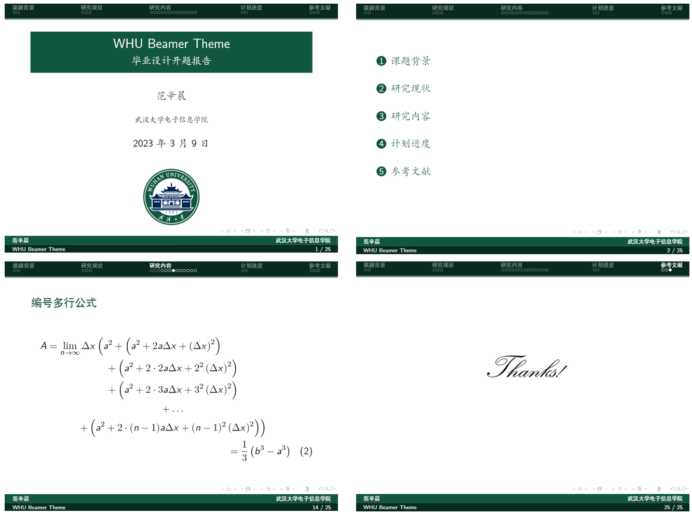

# WHU-Beamer-Theme
WHU 风格的 Beamer 主题，可用于答辩、汇报等

## Instructions

直接下载/导入本项目，编译方式选择 $Xe\LaTeX{}$

(更新: Overleaf 模板位于 [Overleaf: WHU-Beamer-Theme](https://www.overleaf.com/latex/templates/whu-beamer-theme/ngbfvsccrtqn)，可直接打开)

## Features

在 THU beamer 模板上作了一点修改：

:cherry_blossom: 使用 [武汉大学](https://www.whu.edu.cn/info/1153/3232.htm) 官网发布的珞珈绿 (R:17 G:87 B:64；C:89 M:19 Y:72 K:60) 标准色

:cherry_blossom: 更新 2022 版新校徽

## Preview

## Acknowledgements
本项目基于 [THU-Beamer-Theme](https://github.com/tuna/THU-Beamer-Theme)，具体代码细节可参考此仓库